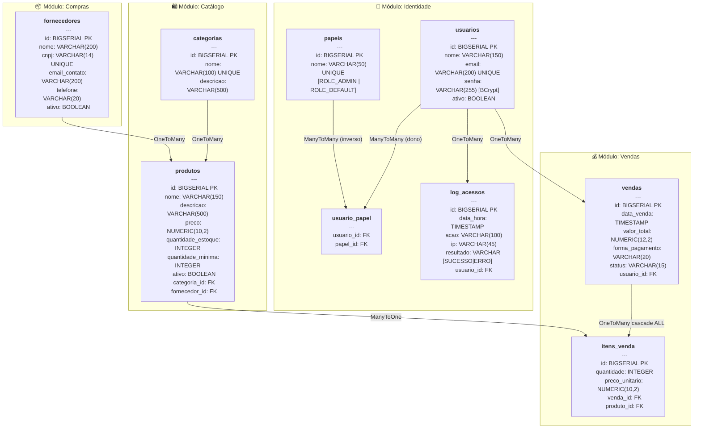

# ERP Barbershop — Documentação do Sistema

> Sistema de gestão (ERP) para barbearias, desenvolvido como projeto acadêmico para a disciplina
> **Programação Orientada a Objetos III** — UERJ, 5º Período (2026).

---

## Sumário

1. [Tecnologias Utilizadas](#1-tecnologias-utilizadas)
2. [Arquitetura do Sistema](#2-arquitetura-do-sistema)
3. [Diagrama de Entidades e Relacionamentos](#3-diagrama-de-entidades-e-relacionamentos)
4. [Funcionalidades do Sistema](#4-funcionalidades-do-sistema)
5. [Segurança e Controle de Acesso](#5-segurança-e-controle-de-acesso)
6. [Get Started](#6-get-started)

---

## 1. Tecnologias Utilizadas

### Backend

| Tecnologia | Versão | Papel |
|---|---|---|
| **Java** | 17 (LTS) | Linguagem principal |
| **Jakarta EE** | 8 | Plataforma corporativa (EJB, JPA, CDI, JSF) |
| **WildFly** | 26.1.3.Final | Servidor de aplicação Jakarta EE |
| **Hibernate ORM** | 5.3.28.Final | Provedor JPA (embutido no WildFly) |
| **Spring Security** | 5.8.14 | Autenticação, autorização e proteção CSRF |
| **PostgreSQL JDBC** | 42.7.3 | Driver de conexão ao banco de dados |

### Frontend

| Tecnologia | Versão | Papel |
|---|---|---|
| **JSF (Jakarta Server Faces)** | 2.3 | Framework de componentes web |
| **PrimeFaces** | 12.0.0 | Biblioteca de componentes UI ricos |

### Banco de Dados

| Tecnologia | Versão | Papel |
|---|---|---|
| **PostgreSQL** | 15-alpine | Banco de dados relacional |

### Relatórios e Exportação

| Tecnologia | Versão | Papel |
|---|---|---|
| **iText 7** | 7.2.5 | Geração de relatórios em PDF |
| **OpenCSV** | 5.9 | Exportação de dados em CSV |

### Infraestrutura e Build

| Tecnologia | Versão | Papel |
|---|---|---|
| **Docker** | — | Conteinerização dos serviços |
| **Docker Compose** | — | Orquestração local dos containers |
| **Maven** | 3.9 | Gerenciamento de dependências e build |
| **Multi-Stage Dockerfile** | — | Separação entre ambiente de build e runtime |

---

## 2. Arquitetura do Sistema

O sistema é um **monolito modular** (WAR único) implantado no WildFly, seguindo os princípios de
**Domain-Driven Design (DDD)** com módulos lógicos separados por contexto de negócio.

```
erp-barbershop.war
├── identidade/     ← Usuários, Papéis, Autenticação, Logs de Acesso
├── catalogo/       ← Produtos, Categorias, Controle de Estoque
├── compras/        ← Fornecedores, Sugestões de Compra
├── vendas/         ← PDV (Ponto de Venda), Itens de Venda
└── relatorios/     ← Dashboard, Relatórios PDF/CSV
```

**Padrão em cada módulo:**
- `model/` — Entidades JPA (persistência)
- `repository/` — Acesso a dados via EntityManager
- `service/` — EJBs Stateless com regras de negócio
- `controller/` — CDI Managed Beans (ViewScoped) conectados às páginas JSF

---

## 3. Diagrama de Entidades e Relacionamentos



### Legenda dos Relacionamentos

| Relação | Tabelas | Tipo |
|---|---|---|
| Usuário ↔ Papel | `usuario_papel` | ManyToMany |
| Usuário → LogAcesso | `log_acessos.usuario_id` | OneToMany |
| Categoria → Produto | `produtos.categoria_id` | OneToMany |
| Fornecedor → Produto | `produtos.fornecedor_id` | OneToMany (nullable — serviços sem fornecedor) |
| Usuário → Venda | `vendas.usuario_id` | OneToMany |
| Venda → ItemVenda | `itens_venda.venda_id` | OneToMany (cascade ALL + orphanRemoval) |
| Produto → ItemVenda | `itens_venda.produto_id` | ManyToOne |

---

## 4. Funcionalidades do Sistema

### 4.1 Módulo: Identidade / Usuários

- **Autenticação** com email + senha (hash BCrypt, fator de custo 12)
- **Cadastro de usuários** com papel `ROLE_ADMIN` ou `ROLE_DEFAULT`
- **Edição de usuários** — nome, email, senha (opcional) e papel
- **Inativação lógica** — usuário nunca é deletado fisicamente
- **Log de acessos** — registra cada login/logout com IP e resultado (SUCESSO/ERRO)
- **Proteção contra força bruta** — bloqueio por IP após tentativas inválidas (`IpBloqueioFilter`)
- **Sessão única** — cada usuário pode ter apenas 1 sessão ativa simultânea

### 4.2 Módulo: Catálogo / Produtos

- **Cadastro de produtos físicos** (com estoque e fornecedor)
- **Cadastro de serviços** (sem estoque, sem fornecedor — ex: corte, barba)
- **Categorização** — cada produto pertence a uma categoria
- **Controle de estoque** — quantidade atual e quantidade mínima
- **Alerta de estoque baixo** — `isEstoqueBaixo()` compara estoque atual com mínimo
- **Soft delete** — desativação lógica preserva histórico de vendas anteriores
- **Cadastro de categorias** — gerenciamento das categorias de produtos

### 4.3 Módulo: Compras / Fornecedores

- **Cadastro de fornecedores** com nome, CNPJ, email e telefone
- **Inativação lógica** de fornecedores
- **Sugestão de compras automática** (`SugestaoCompra`) — calcula quantidade sugerida baseada em:
  - Estoque atual vs. estoque mínimo
  - Média diária de consumo (últimos 30 dias)
  - Urgência (estoque zerado, crítico, baixo)

### 4.4 Módulo: Vendas / PDV

- **Ponto de Venda (PDV)** — abertura de venda com carrinho de compras
- **Adição/remoção de itens** — cada item registra preço como snapshot (imutável no histórico)
- **Recálculo automático do total** — soma dos itens (preço unitário × quantidade)
- **Formas de pagamento**: `BOLETO`, `CARTAO_CREDITO`, `PIX`
- **Ciclo de vida da venda**:
  - `ABERTA` → venda em composição (carrinho)
  - `FECHADA` → venda finalizada e paga
  - `CANCELADA` → venda cancelada

### 4.5 Módulo: Relatórios / Dashboard

- **Dashboard** — visão geral com indicadores de desempenho
- **Relatório de vendas por dia** (`VendasPorDiaDTO`)
- **Ranking de produtos mais vendidos** (`ProdutoMaisVendidoDTO`)
- **Exportação de relatórios** em **PDF** (iText 7) e **CSV** (OpenCSV)

---

## 5. Segurança e Controle de Acesso

| Página | Papéis permitidos |
|---|---|
| `/login.xhtml` | Público (sem autenticação) |
| `/pages/identidade/**` | Apenas `ROLE_ADMIN` |
| `/pages/relatorios/**` | Apenas `ROLE_ADMIN` |
| `/pages/vendas/**` | `ROLE_ADMIN` ou `ROLE_DEFAULT` |
| `/pages/catalogo/**` | `ROLE_ADMIN` ou `ROLE_DEFAULT` |
| `/pages/compras/**` | `ROLE_ADMIN` ou `ROLE_DEFAULT` |

**Headers de segurança ativos:**
- `Strict-Transport-Security` (HSTS — 1 ano)
- `X-Content-Type-Options: nosniff`
- `X-XSS-Protection: 1; mode=block`
- `X-Frame-Options: DENY`
- Proteção CSRF habilitada

---

## 6. Get Started

### Pré-requisitos

- [Docker Desktop](https://www.docker.com/products/docker-desktop/) instalado e em execução
- Portas **8080**, **9990** e **5432** livres na máquina

---

### Passo 1 — Limpar containers e volumes existentes

> ⚠️ **Atenção:** o `-v` apaga todos os dados do banco. Omita-o se quiser preservar os dados.

```powershell
docker-compose down -v
```

Isso remove:
- Containers `erp-barbershop-app` e `erp-barbershop-db`
- Volume `pgdata` (dados do PostgreSQL)
- Rede `erp-network`

---

### Passo 2 — Buildar e subir os containers

```powershell
docker-compose up --build
```

O que acontece internamente:
1. **Stage 1 (builder):** Maven baixa dependências e compila o projeto → gera `erp-barbershop.war`
2. **Stage 2 (runtime):** WildFly instala o módulo PostgreSQL e configura o datasource via CLI
3. **PostgreSQL sobe primeiro** — o WildFly aguarda o healthcheck passar antes de iniciar
4. **Schema DDL executado** — `docs/schema.sql` é aplicado automaticamente pelo PostgreSQL na primeira execução (cria tabelas e insere os 4 papéis padrão)
5. **WildFly faz deploy** do WAR e o Hibernate valida/atualiza o schema

Aguarde a mensagem:
```
WildFly Full 26.1.3.Final started in Xms
```

---

### Passo 3 — Acessar a aplicação

| Serviço | URL | Credencial |
|---|---|---|
| **Aplicação** | http://localhost:8080/erp-barbershop | (ver Passo 4) |
| **WildFly Admin Console** | http://localhost:9990 | `admin` / `Admin#2026` |
| **PostgreSQL** | `localhost:5432` | `erp_admin` / `erp_secret_2026` |

---

### Passo 4 — Criar o primeiro usuário (Admin)

> ⚠️ **Não existe usuário padrão pré-cadastrado.** O banco inicia apenas com os papéis cadastrados.
> É necessário inserir o primeiro usuário administrador diretamente no banco.

#### Gerar o hash BCrypt da senha

A senha é armazenada com **BCrypt, fator de custo 12**. Você pode gerar o hash online em:
https://bcrypt-generator.com (use rounds = 12)

Exemplo: a senha `admin123` gera um hash como:
```
$2a$12$Yl3v8RHg5NZbKl0jqGfRhOrEkFKqFBgGUCvR5k7dKxIMHKW8O6Mna
```

#### Inserir o usuário via SQL no container

```powershell
# Entrar no psql do container
docker exec -it erp-barbershop-db psql -U erp_admin -d erp_db
```

```sql
-- 1. Verificar se os papéis já existem
SELECT * FROM papeis;

-- 2. Inserir o usuário admin
-- SUBSTITUA o hash abaixo pelo hash BCrypt gerado para a sua senha!
INSERT INTO usuarios (nome, email, senha, ativo)
VALUES (
    'Administrador',
    'admin@barbearia.com',
    '$2a$12$Yl3v8RHg5NZbKl0jqGfRhOrEkFKqFBgGUCvR5k7dKxIMHKW8O6Mna',
    true
);

-- 3. Vincular o usuário ao papel ROLE_ADMIN
INSERT INTO usuario_papel (usuario_id, papel_id)
SELECT u.id, p.id
FROM usuarios u, papeis p
WHERE u.email = 'admin@barbearia.com'
  AND p.nome = 'ROLE_ADMIN';

-- 4. Confirmar
SELECT u.nome, u.email, u.ativo, p.nome AS papel
FROM usuarios u
JOIN usuario_papel up ON u.id = up.usuario_id
JOIN papeis p ON p.id = up.papel_id;

-- Sair
\q
```

Agora acesse http://localhost:8080/erp-barbershop e faça login com:
- **Email:** `admin@barbearia.com`
- **Senha:** a senha que você usou para gerar o hash (ex: `admin123`)

---

### Comandos SQL Úteis para Desenvolvimento

```powershell
# Conectar ao banco
docker exec -it erp-barbershop-db psql -U erp_admin -d erp_db

# Rodar uma query direta (sem entrar no psql)
docker exec erp-barbershop-db psql -U erp_admin -d erp_db -c "SELECT * FROM usuarios;"

# Rodar um arquivo .sql externo
docker exec -i erp-barbershop-db psql -U erp_admin -d erp_db < meu_script.sql
```

```sql
-- Listar todas as tabelas
\dt

-- Ver estrutura de uma tabela
\d usuarios
\d produtos
\d vendas

-- Ver todos os usuários e seus papéis
SELECT u.id, u.nome, u.email, u.ativo, p.nome AS papel
FROM usuarios u
LEFT JOIN usuario_papel up ON u.id = up.usuario_id
LEFT JOIN papeis p ON p.id = up.papel_id
ORDER BY u.nome;

-- Ver todos os produtos com categoria e fornecedor
SELECT p.nome, p.preco, p.quantidade_estoque, c.nome AS categoria, f.nome AS fornecedor
FROM produtos p
JOIN categorias c ON c.id = p.categoria_id
LEFT JOIN fornecedores f ON f.id = p.fornecedor_id
WHERE p.ativo = true
ORDER BY p.nome;

-- Ver vendas do dia
SELECT v.id, v.data_venda, v.valor_total, v.status, v.forma_pagamento, u.nome AS vendedor
FROM vendas v
JOIN usuarios u ON u.id = v.usuario_id
WHERE DATE(v.data_venda) = CURRENT_DATE
ORDER BY v.data_venda DESC;

-- Ver itens de uma venda específica (substitua 1 pelo ID da venda)
SELECT iv.id, pr.nome AS produto, iv.quantidade, iv.preco_unitario,
       (iv.quantidade * iv.preco_unitario) AS subtotal
FROM itens_venda iv
JOIN produtos pr ON pr.id = iv.produto_id
WHERE iv.venda_id = 1;

-- Ver log de acessos recentes
SELECT u.nome, l.acao, l.resultado, l.ip, l.data_hora
FROM log_acessos l
JOIN usuarios u ON u.id = l.usuario_id
ORDER BY l.data_hora DESC
LIMIT 20;

-- Produtos com estoque baixo (precisam de reposição)
SELECT nome, quantidade_estoque, quantidade_minima
FROM produtos
WHERE ativo = true
  AND quantidade_estoque IS NOT NULL
  AND quantidade_estoque <= quantidade_minima
ORDER BY quantidade_estoque;

-- Resetar senha de um usuário
-- (substitua pelo novo hash BCrypt gerado)
UPDATE usuarios
SET senha = '$2a$12$SEU_NOVO_HASH_AQUI'
WHERE email = 'admin@barbearia.com';
```

---

### Parar os containers (sem apagar dados)

```powershell
docker-compose down
```

### Parar E apagar todos os dados

```powershell
docker-compose down -v
```

### Ver logs em tempo real

```powershell
# Todos os containers
docker-compose logs -f

# Apenas o WildFly
docker-compose logs -f wildfly --tail 100

# Apenas o PostgreSQL
docker-compose logs -f postgres
```
